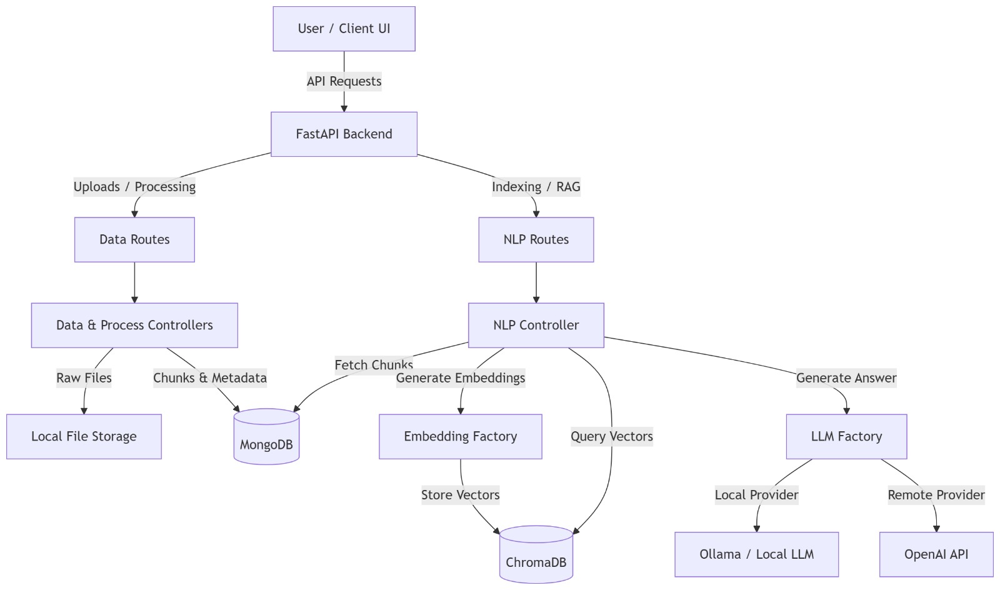

# Technical Report: LocalRAG

## 1. Executive Summary
LocalRAG is a robust, privacy-first Retrieval-Augmented Generation (RAG) system designed to process, index, and query uploaded documents locally. The system allows users to upload various document formats (TXT, PDF, DOCX, HTML), securely processes them using overlapping chunks, and stores them in both a MongoDB instance (for document metadata) and a VectorDB (ChromaDB) for semantic search. A Factory Pattern architecture enables seamless switching between LLM providers (e.g., local Ollama, remote APIs) and embedding models. The system incorporates extensive Arabic language support (via NFKC normalization, ligature fixing, and HTML whitelisting) to ensure high-quality, localized question-answering capabilities.

## 2. System Architecture



## 3. API Documentation

### Data Endpoints
- **Upload File**
  - `POST /api/data/upload/{dir_name}`
  - **Payload**: `multipart/form-data` with a `file` field.
  - **Response**: `200 OK` with `project_id` and `file_name`.

- **Process File**
  - `POST /api/data/process/{project_id}`
  - **Payload (JSON)**:
    ```json
    {
      "file_name": "example.pdf",
      "chunk_size": 500,
      "overlap": 50,
      "do_reset": 0
    }
    ```
  - **Response**: `200 OK` with `chunks_count`.

### NLP Endpoints
- **Push Data to Index**
  - `POST /api/nlp/index/push/{project_id}`
  - **Payload (JSON)**:
    ```json
    {
      "do_reset": 1
    }
    ```
  - **Response**: `200 OK` with success message.

- **Check Index Info**
  - `GET /api/nlp/index/info/{project_id}`
  - **Response**: `200 OK` with `{"results": true/false}` (collection existence).

- **Search Vector Index**
  - `POST /api/nlp/index/search/{project_id}`
  - **Payload (JSON)**:
    ```json
    {
      "text": "Query string",
      "top_k": 5
    }
    ```
  - **Response**: `200 OK` with a list of results and similarity scores.

- **Generate Answer (RAG)**
  - `POST /api/nlp/index/answer/{project_id}`
  - **Payload (JSON)**:
    ```json
    {
      "text": "ما هي اهداف الكلية",
      "top_k": 5,
      "lang": "ar",
      "model": "llama3"
    }
    ```
  - **Response**: `200 OK` with `answer`, `full_prompt`, and `chat_history`.

## 4. Embedding Model & Chunking Strategy
- **Embedding Model**: The application utilizes `BAAI/bge-small-en` (configurable via `.env`) and supports localized models via the LLMFactory pattern. This choice is justified due to its balance between processing speed, low memory footprint, and high accuracy for semantic representation on consumer-grade hardware.it works  for English and Arabic. but for better results in Arabic and multilingual contexts, it is recommended to replace this with a multilingual variant integrates seamlessly into the `local_bge` provider.
- **Chunking Strategy**: The default chunking strategy utilizes a `chunk_size` of 500 characters with an `overlap` of 50 characters (as defined in the Streamlit interface). A chunk size of 500 characters is optimal for documents like university handbooks and program guidelines, as it is large enough to encapsulate a complete academic policy, course description, or set of requirements in a single chunk without diluting the semantic focus. Meanwhile, the 10% sliding window overlap ensures that important contextual links between paragraphs and sentences are not severed across chunk boundaries. Importantly, the **chunk size**, **chunk overlap**, and the **top K** (number of retrieved context chunks) are fully customizable in real-time via the User Interface and the API to dynamically accommodate varying document types and LLM context window limits.

## 5. Arabic Language Processing
The pipeline implements robust preprocessing mechanisms to handle the complexities of Arabic text extraction and generation natively:
- **Text Normalization**: The system uses NFKC (Normalization Form Compatibility Composition) to handle the 'لا'  variations and not break it into separate characters Additionally, the text is heavily cleaned by removing diacritics (Harakat/Tashkeel) and visual stretching (Tatweel), and by unifying different shapes of the Alef letter for example (أ, إ, آ) into a single standard form (ا). This ensures the embedding model isn't confused by visual formatting.
- **HTML Whitelist Parsing**: When ingesting HTML files, the pipeline utilizes strict tag whitelisting. This eliminates layout noise and broken right-to-left (RTL) formatting issues, ensuring the logical word order of Arabic sentences is preserved.
- **Language-Aware Templating**: The RAG generation template automatically switches between English and Arabic (`lang="ar"`) based on user requests, ensuring the LLM is primed with an Arabic system persona and context headers.

## 6. Arabic Test Case Evaluation
The system was validated using an Arabic query via the UI:
- **Query**: ما هي اهداف الكلية (What are the college's goals?)
- **Configuration**: 10 Context Chunks, Language `ar`.
- **Generated Answer**:
  وفقًا للمستندات المقدمة، تركز أهداف الكلية على:
  - تطوير مهارات تنافسية: لإعداد الطلاب للعمل في عالم متطور.
  - التطبيق العلمي: بناءً على النظرية، تهدف إلى تطبيق المعرفة في مجالات مختلفة.
  - تحسين التنمية: لتحقيق التنمية في مختلف المجالات.
  - تطوير البحث العلمي: لإعداد الطلاب للبحث العلمي والعمل في مجال البحث.
- **Result**: The response was generated accurately in 6.28 seconds, demonstrating successful extraction, normalization, retrieval, and coherent text generation in Arabic.

## 7. Docker Deployment Instructions

*Placeholder instructions - Pending implementation by the Mai and Nada.*

```bash
# TODO: Team to fill in docker build and run steps.
# Examples:
# docker-compose up -d
# docker build -t localrag .
# docker run -p 8000:8000 localrag
```

## 8. Local Execution Instructions

To run the project locally for development or testing, follow these steps:

### Prerequisites
1. **MongoDB**: Ensure a local MongoDB instance is running on `mongodb://localhost:27017` (or update `.env` to point to your cluster).
2. **Ollama**: Ensure Ollama is installed and running locally with your desired models pulled (e.g., `ollama pull gemma2:2b`).
3. **Python Environment**: Install the required dependencies from `src/requirements.txt`:
   ```bash
   pip install -r src/requirements.txt
   ```

### 1. Start the FastAPI Backend
Navigate to the `src` directory and start the server using `uvicorn`:
```bash
cd src
uvicorn main:app --port 8000
```

> **Note for Developers**: If you want Uvicorn to constantly monitor your Python files and automatically restart the server whenever you make code changes, use this command instead:
> ```bash
> uvicorn main:app --port 8000 --reload
> ```

The API documentation will be accessible at [http://localhost:8000/docs](http://localhost:8000/docs).

### 2. Start the User Interface
The project includes a Streamlit application for the UI. Open a new terminal, navigate to the `src` directory, and run:
```bash
cd src
streamlit run interface.py
```
This will open the web interface in your default browser (typically at [http://localhost:8501](http://localhost:8501)), allowing you to upload documents, process them, and query the RAG system.
